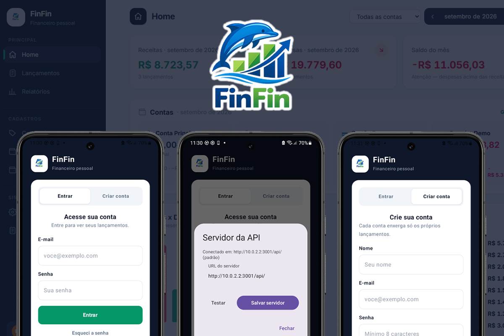

# FinFin Android



Cliente Android nativo do **[FinFin](https://github.com/fernandovaller/finfin)** — controle financeiro pessoal em português (pt-BR), 100% local.

Este repositório contém **apenas o app Android**. O backend (NestJS + SQLite) e o frontend web (React) vivem no repositório principal:

👉 **https://github.com/fernandovaller/finfin**

O app consome a mesma API REST do backend (`/api/...`) e espelha as telas e fluxos do frontend web. Ele **não funciona sozinho**: é preciso ter o backend do FinFin rodando e apontar o app para ele.

## Recursos

Paridade com o frontend web (`navigation/Rotas.kt` espelha `frontend/src/main.tsx`):

- **Home** — resumo do mês (receitas, despesas, saldo), saldos por conta e gráficos, com filtro por conta
- **Lançamentos** — CRUD de receitas/despesas com máscara BRL e filtro por mês/conta; despesa parcela em até 21x (exclusão individual ou do grupo parcelado)
- **Relatórios** — totais do mês, despesas por categoria e por forma de pagamento, últimos 6 meses, com filtros por conta, categoria, forma, valor e texto + exportação
- **Contas** — CRUD com saldo inicial (aceita negativo), ícone, nota e conta principal; exclusão bloqueada se estiver em uso
- **Categorias** — CRUD com tipo (receita/despesa) e cor; exclusão bloqueada se estiver em uso
- **Formas de pagamento** — CRUD (Dinheiro, PIX, cartões…); exclusão bloqueada se estiver em uso
- **Extrato OFX** — importa arquivo `.ofx` escolhendo a conta destino, com anti-duplicidade por FITID (parser local em `core/util/OfxParser.kt`)
- **Auditoria** — trilha de CRUD + login/import/export com filtros (módulo, ação, descrição, período), paginação e **restauração de itens excluídos**
- **Configurações** (4 abas, como na web):
  - *Geral* — contadores, tema claro/escuro/sistema e troca de servidor da API
  - *Backup* — exporta JSON completo ou CSV (receitas/despesas) via seletor de arquivos, importa backup JSON (mesclar/substituir), repõe catálogo padrão, gera/remove dados demo
  - *E-mail* — salva/limpa chave do Resend (recuperação de senha)
  - *Perigo* — apaga lançamentos ou apaga tudo (com confirmação `APAGAR`)
- **Conta** — cadastro/login, perfil com avatar, troca de senha, recuperação/redefinição por e-mail; token Bearer em memória + DataStore; troca de servidor desconecta
- **Servidor dinâmico** — URL da API configurável em tempo de execução (testada via `GET /api/saude` antes de salvar), sem precisar recompilar

## Stack

| Camada | Tecnologia |
|---|---|
| Linguagem | Kotlin |
| UI | Jetpack Compose + Material 3 + Navigation Compose |
| DI | Hilt (KSP) |
| Rede | Retrofit 2 + Gson + OkHttp (interceptor de auth + host dinâmico) |
| Persistência local | DataStore Preferences (token, tema, URL do servidor) |
| Assíncrono | Coroutines + ViewModel |

Requisitos: **Android Studio Ladybug+**, **JDK 17**, **minSdk 29**.

## Como rodar

1. Suba o backend do repositório principal (veja [finfin — Como rodar](https://github.com/fernandovaller/finfin#como-rodar)):

   ```bash
   git clone https://github.com/fernandovaller/finfin.git
   cd finfin
   npm run setup
   npm run dev:backend   # http://localhost:3001/api
   ```

2. Configure a URL base **antes** de compilar (o padrão já funciona no emulador):

   | Ambiente | `finfin.baseUrl` |
   |---|---|
   | Emulador (padrão) | `http://10.0.2.2:3001/api/` |
   | Dispositivo físico na mesma rede | `http://SEU-IP:3001/api/` (ex.: `http://192.168.0.10:3001/api/`) |

   Via `local.properties` (não commitado):

   ```properties
   finfin.baseUrl=http://192.168.0.10:3001/api/
   ```

   Ou via propriedade Gradle: `-Pfinfin.baseUrl=http://192.168.0.10:3001/api/`.

   > `localhost` dentro do app aponta para o próprio aparelho/emulador, nunca para o seu PC. No emulador use `10.0.2.2`.

3. Abra este projeto no Android Studio e rode (`Run ▶`):

   ```bash
   ./gradlew installDebug
   ```

4. No app, crie sua conta. Para explorar sem digitar nada: **Configurações → Backup → Gerar demo**. Para apontar para outro backend depois: **Configurações → Geral → Servidor da API**.

## Estrutura

```
app/src/main/java/com/fvcode/finfin/
├── data/
│   ├── model/Modelos.kt          # DTOs (espelho da API)
│   ├── remote/FinfinApi.kt       # interface Retrofit (espelho de docs/specs/10-api.md)
│   └── repository/               # FinfinRepository, AuthRepository
├── core/
│   ├── network/                  # AuthInterceptor, DynamicHostInterceptor, ApiResult
│   ├── datastore/                # token, tema, baseUrl
│   └── util/                     # Formatacao (BRL), OfxParser
├── navigation/                   # Rotas, FinfinNavGraph
├── ui/
│   ├── home/ auth/ lancamentos/ relatorios/ ofx/
│   ├── contas/ categorias/ formas/ auditoria/
│   ├── perfil/ config/ servidor/ session/ components/
│   └── theme/
└── di/                           # NetworkModule, DataModule (Hilt)
docs/specs/                        # especificações espelhadas do backend (01–10)
```

As especificações em `docs/specs/` documentam o contrato com o backend (visão geral, auth, catálogo, auditoria, import/export/demo, API).

## Notas

- Todo o texto do app é em **pt-BR**, como no projeto principal.
- Os dados ficam no SQLite do backend — nada sai da sua máquina.
- Trocar de servidor no app faz logout (o token do backend antigo não vale no novo).

## Licença

MIT — veja [LICENSE](LICENSE).
